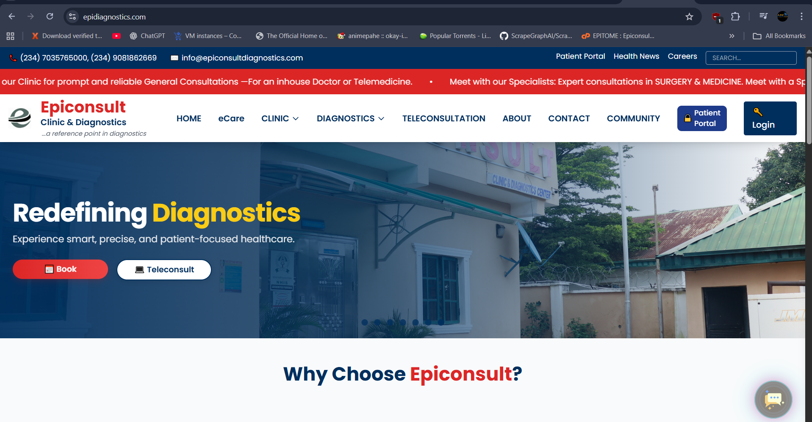
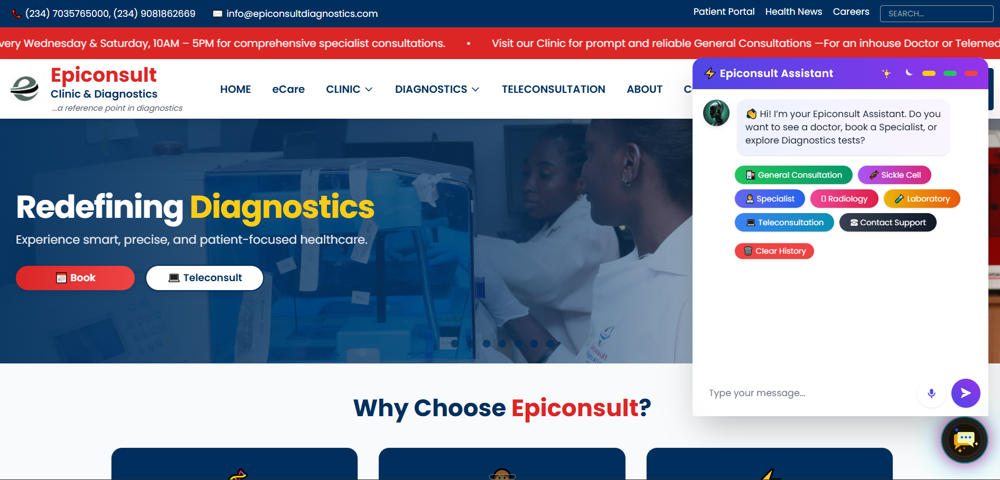
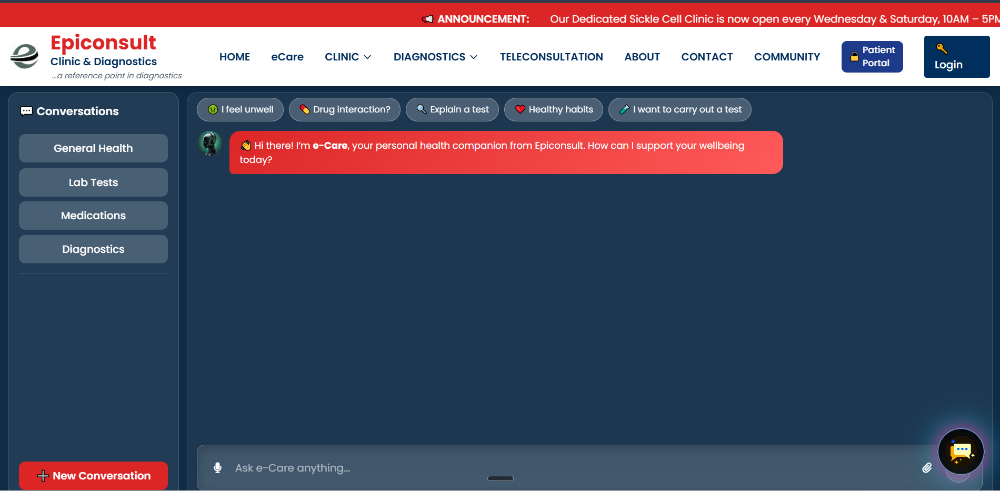
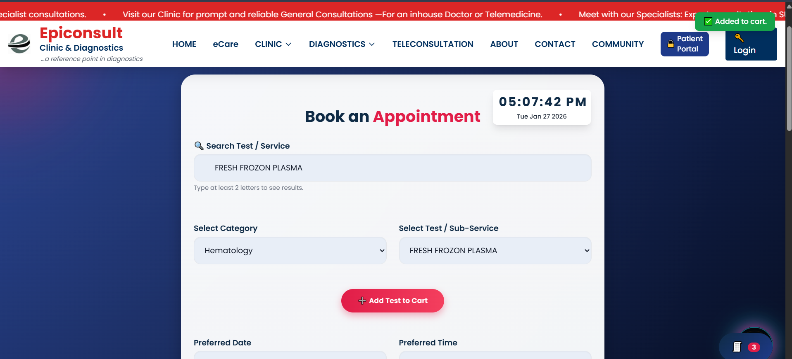

# **Epiconsult Diagnostics Website**

A modern, responsive healthcare diagnostics and digital clinic website for **Epiconsult Clinic & Diagnostics**.  
This platform delivers a complete online healthcare experience — from service discovery and community engagement to intelligent chatbot-assisted appointment booking.

🌐 **Live Website:** https://www.epidiagnostics.com  

---

## **📸 Website Preview**

[](static/images/epi1.PNG)  
[](static/images/epi2.PNG)  
[](static/images/epi3.PNG)  
[](static/images/epi4.PNG)  

---

## **🚀 Key Features**

- **AI Chatbot Assistant**
  - Real-time chat support  
  - Guides patients  
  - Helps users **book appointments directly**  
  - Provides instant service navigation  

- **Direct Appointment Booking System**
  - Fast online appointment scheduling  
  - Smart workflow routing  

- **Community Health Section**
  - Health education  
  - Medical awareness content  
  - Public health engagement  

- **Specialized Medical Clinics**
  - General Medicine Clinic  
  - Surgery Clinic  
  - Sickle Cell Clinic  

- **Diagnostics Laboratory Module**
  - Laboratory services showcase  
  - Test listings  
  - Diagnostic workflows  

- **Modern Medical UI/UX**
  - Clean, professional healthcare design  
  - Fully responsive on desktop, tablet & mobile  

- **Fast Performance & SEO Optimized**

---

## **🛠️ Tech Stack**

- **Frontend:** HTML5, Tailwind CSS, JavaScript  
- **Backend:** Flask (Python)  
- **Template Engine:** Jinja2  
- **Database:** Supabase / PostgreSQL  
- **Deployment:** WSGI-compatible servers (Gunicorn, uWSGI, etc.)

---

## **📂 Project Structure**

epiconsult-website/
│
├── .env                         # Environment variables
├── .gitignore                   # Git ignore rules
├── app.py                       # Main Flask application entry point
├── booking.py                  # Appointment booking logic
├── bot.py                      # AI chatbot engine
├── requirements.txt            # Python dependencies
├── runtime.txt                 # Runtime environment config
├── package.json                # Frontend tooling dependencies
├── README.md                   # Project documentation
│
├── blueprints/                 # Flask blueprint modules (routes & views)
│   ├── api_endpoints.py
│   ├── clinic.py
│   ├── diagnostics.py
│   ├── info.py
│   ├── main.py
│   └── __init__.py
│
├── services/                   # Core backend services & business logic
│   ├── auth_supabase.py        # Authentication & authorization
│   ├── data_loader.py          # Data ingestion & loaders
│   ├── email_server.py         # Email notification system
│   ├── engine.py               # Core system engine
│   ├── lab.py                  # Laboratory services logic
│   ├── reports.py              # Reporting module
│   ├── user_db.py              # User data management
│   ├── data/
│   │   └── users.json
│   └── __init__.py
│
├── static/                     # Frontend static assets
│   ├── css/                    # Stylesheets
│   ├── js/                     # JavaScript modules
│   ├── images/                # Images & branding assets
│   │   ├── epi1.PNG
│   │   ├── epi2.PNG
│   │   ├── epi3.PNG
│   │   └── epi4.PNG
│   ├── data/                  # JSON datasets & chatbot configs
│   ├── sounds/                # Notification sounds
│   └── videos/                # Promotional & UI videos
│
├── templates/                  # Jinja2 HTML templates
│   ├── base.html
│   ├── index.html
│   ├── appointment.html
│   ├── community.html
│   ├── laboratory.html
│   ├── teleconsultation.html
│   ├── login.html
│   ├── profile.html
│   │
│   ├── clinic/                # Clinic module templates
│   │   ├── base_clinic.html
│   │   ├── general.html
│   │   ├── sickle_cell.html
│   │   └── specialist.html
│   │
│   └── partials/              # Shared layout components
│       ├── hero.html
│       └── carousel_slide.html
│
├── dataset/                    # Medical datasets & reference documents
├── new_database/               # Structured medical datasets (Excel / PDF)
├── epiconsult_assets/          # Legacy site static assets
├── jaiz_assets/                # External web build assets
└── __pycache__/                # Python cache files


---

## **⚙️ Installation & Setup**

### **1️⃣ Clone Repository**
```bash
git https://github.com/acetosyn/Epiconsult_Website_2025.git
cd epiconsult-website

2️⃣ Install Dependencies
pip install -r requirements.txt

3️⃣ Run Flask Application
flask run

4️⃣ Open in Browser
http://127.0.0.1:5000

🧠 System Highlights

Intelligent chatbot-assisted patient flow

Seamless appointment booking UX

Scalable architecture for future hospital modules

Designed as a foundation for a full e-Clinic ecosystem

📧 Contact

Developer: Hakeem Tosin
Email: tosinhakeem4@gmail.com

Phone: +234 803 669 1680

📜 License

This project is licensed exclusively for Epiconsult Clinic & Diagnostics.
All rights reserved © 2025.